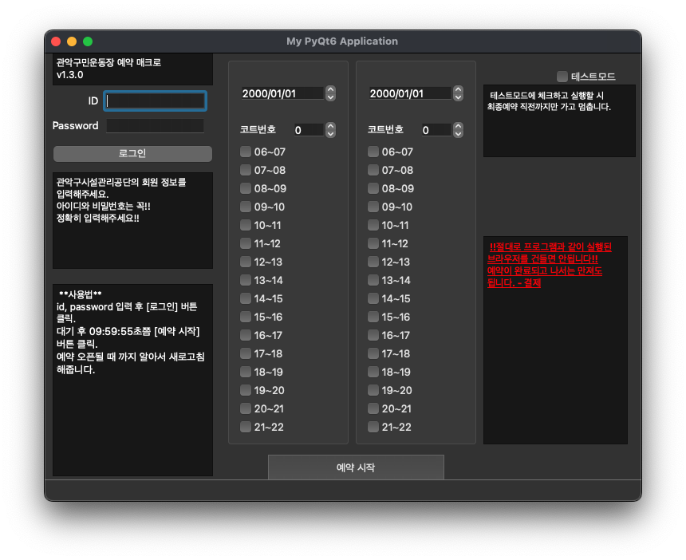
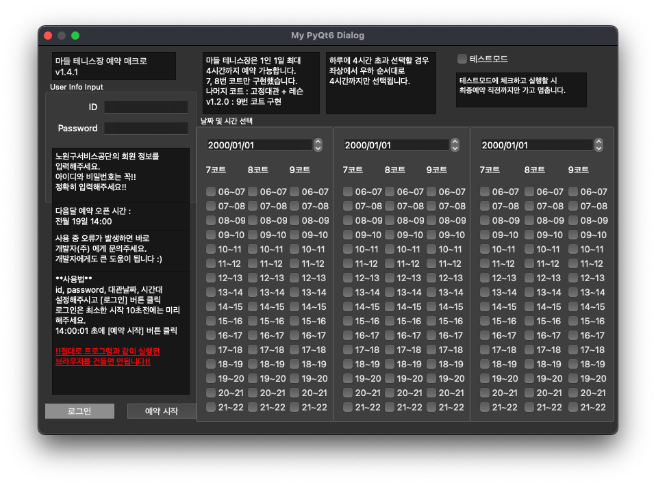

# 테니스 코트 자동 예약 프로그램

### 🎾 개발 기간 : 2022년 5월 ~ 2023년 2월
######  ** 예약 웹 사이트의 변경으로 2023년 2월 이후로 동작하지 않습니다.

### 🎾 예약 가능 코트
|     코트 명     |         주소          |
|:------------:|:-------------------:|
| 관악구민운동장 테니스장 |  서울특별시 관악구 낙성대로 40  |
| 마들 근린공원 테니스장 | 서울특별시 노원구 상계동 770-2 |

### 🎾 코트 별 레포지토리 이동
- [관악구민운동장 테니스장 - macOS](https://github.com/thisIsJooS/tennis-court-auto-reservation/tree/main/gwanak-for-mac)
- [관악구민운동장 테니스장 - Window](https://github.com/thisIsJooS/tennis-court-auto-reservation/tree/main/gwanak-for-window)
- [마들 근린공원 테니스장 - macOS](https://github.com/thisIsJooS/tennis-court-auto-reservation/tree/main/madeul-for-mac)
- [마들 근린공원 테니스장 - Window](https://github.com/thisIsJooS/tennis-court-auto-reservation/tree/main/madeul-for-window)

### 🎾 사용 방법
1. 프로그램을 실행하고자 하는 로컬 컴퓨터의 Chrome 브라우저 버전과 일치하는 chromedriver 다운로드 
   - [chromedriver 다운로드](https://chromedriver.storage.googleapis.com/index.html)
2. 프로그램 실행
   - [PyInstaller](https://pyinstaller.org/en/stable/) 명령어를 통해 실행파일로 빌드 후 실행
   - [PyQt6](https://pypi.org/project/PyQt6/), [Selenium](https://www.selenium.dev/) 라이브러리 수동 설치 후 py 파일 실행

### 🎾 UI

